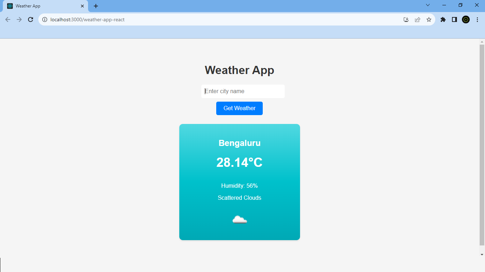

# Weather App



A simple and user-friendly weather application that fetches and displays real-time weather data based on user input. It integrates with the OpenWeatherMap API to provide accurate weather information, including conditions, temperature, and humidity.

## Table of Contents
- [Features](#features)
- [Demo](#demo)
- [Getting Started](#getting-started)
  - [Prerequisites](#prerequisites)
  - [Installation](#installation)
- [Usage](#usage)
- [API Integration](#api-integration)
- [Contributing](#contributing)

## Features
- Responsive user interface for easy access on various devices.
- Auto-suggestions for city names using the react-autosuggest library.
- Display of temperature in Celsius.
- Integration with the OpenWeatherMap API for real-time weather data.
- Error handling for empty city input.

## Demo
Visit the live demo of the Weather App: [https://g-nizam-a.github.io/weather-app](https://g-nizam-a.github.io/weather-app-react/)


## Getting Started
### Prerequisites
- Node.js v16.14.2
- npm v8.5.0
- React v18.2.0

### Installation
1. Clone the repository:
   ```sh
   git clone https://github.com/your-username/weather-app-react.git

2. Navigate to the project directory:
   ```sh
   cd weather-app

3. Install dependencies:
   ```sh
   npm install

## Usage
1. Start the development server:
   ```sh
   npm start

2. Open your web browser and go to http://localhost:3000 to access the Weather App

## API Integration

The Weather App integrates with the OpenWeatherMap API to fetch weather data. You can customize the API endpoint and parameters in the getWeather function within the App.js file.
https://home.openweathermap.org/api_keys
To use your own API key, replace API_KEY in the api.js file with your OpenWeatherMap API key.

## Contributing

Contributions to this project are welcome! Feel free to open issues and submit pull requests for any improvements, bug fixes, or new features.
